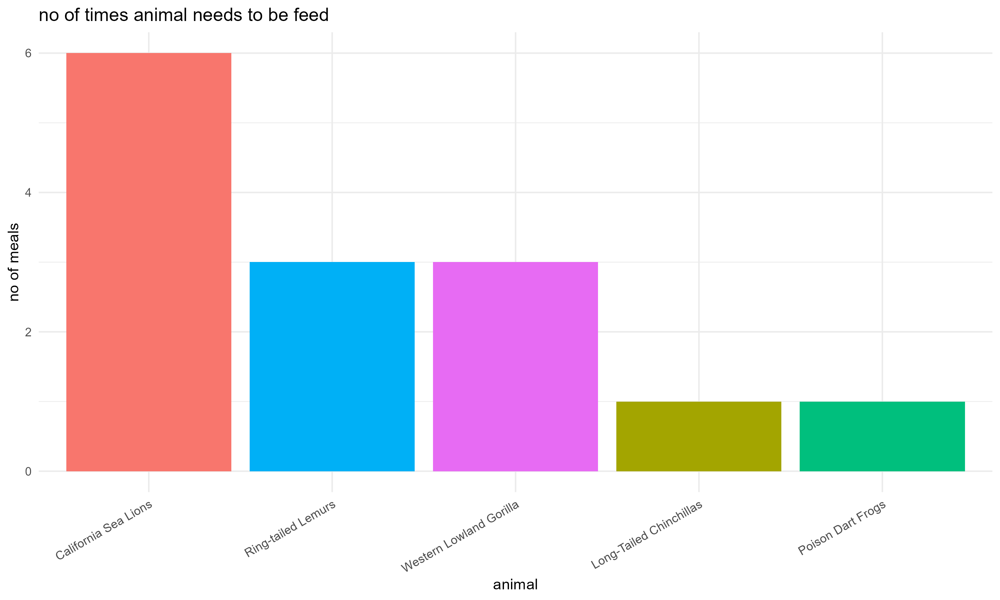

# 🦁 Manhattan-Zoo

**Meal guidelines for animals at the Manhattan Zoo**  
This project helps zookeeper interns understand feeding routines for a variety of animals through structured data and visualizations.

---

## 📁 Project Structure

- `manhattan_zoo_meal_schedule.xlsx` → Feeding schedule data
- `zoo_feeding_plot.png` → Visual summary of feeding frequencies
- `Data visualization.R` → R script for generating visualizations
- `meal-regimens.txt` → Original feeding instructions
- `README.md` → You’re reading it! 😄

---

## 📊 Feeding Visualization

Below is a bar chart representing how many times each animal is fed per day:



---

## 🚀 How to Run

1. Open the R script `Data visualization.R`
2. Make sure required libraries are installed:
   ```r
   install.packages(c("readxl", "ggplot2", "dplyr"))
